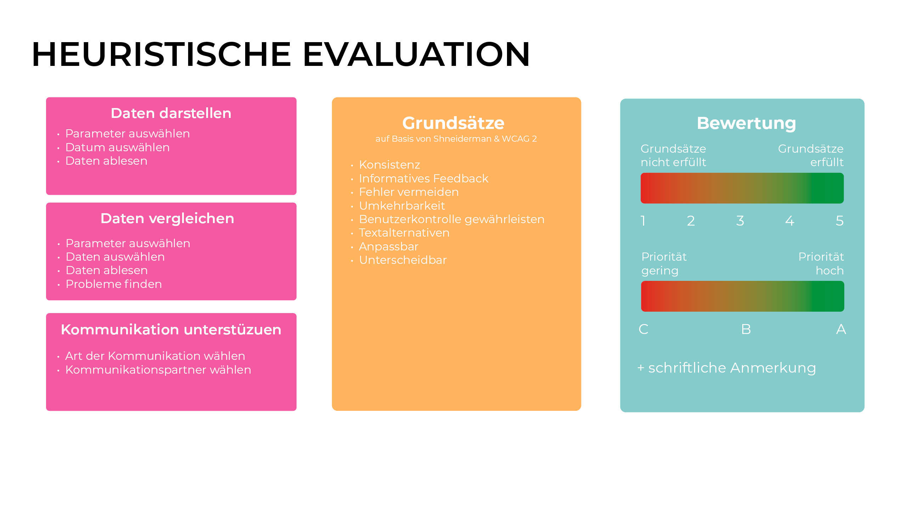
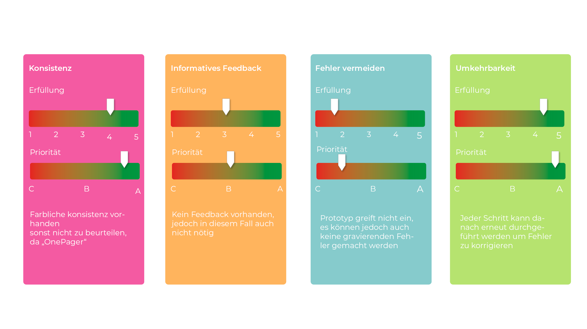
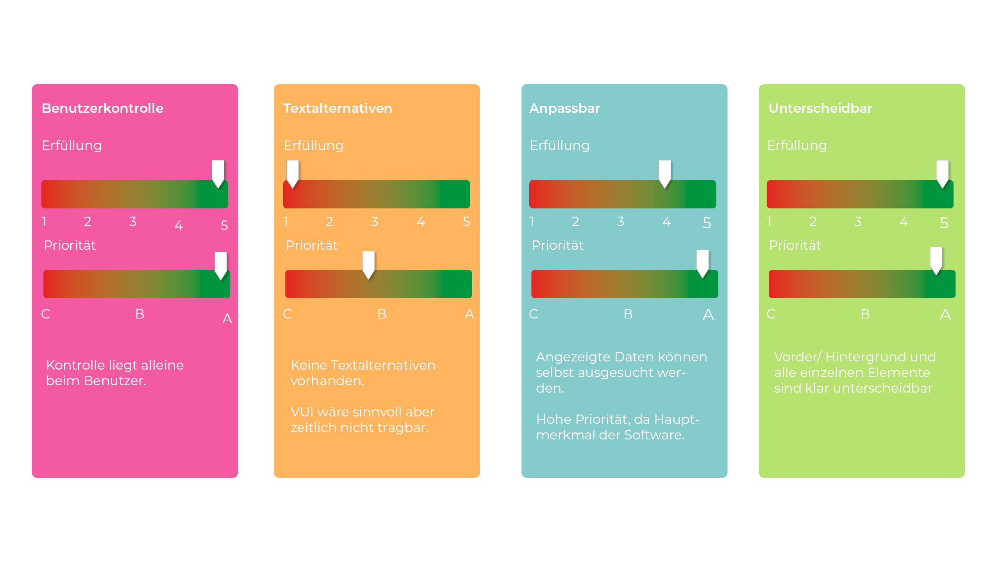

# Prototyp enhancement

Ich habe mich dazu entschieden den Prototypen aus Aufgabe 3 weiter zu entwickeln. Der Prototyp ist [hier](http://ifdtask3.fabianflaig.de/) abrufbar.

Für die Customer Journey Map habe ich die Stimmung, die Doings und sein Problem sowie die meinerseits angebotene Lösung für die Phasen Awareness, Research, Conversion, Onboarding ind Experience angeschaut.

Für die heuristische Evaluation habe ich die wichtigsten Aufgaben des Prototyps in einzelne SChritte unterteilt, einen Katalog von Grundsätzen, nach Shneiderman und WCAG 2 zusammengestellt, die ich in diesem Fall für sinnvoll halte. Auserdem habe ich eine Bewertungsskala festgelegt.

Die Evaluierung der einzelnen Interaktionsschritte machte für mich relativ wenig Sinn, da der Vorgänger-Prototyp sehr minimalistisch ist. Also habe ich den Prototypen im Gesamten evaluiert und mir v.a. bei der Weiterentwicklung des Prototypen immer wieder die ausgesuchten Grundsätze vorgehalten.

[Den Prototypen habe ich in einem Screencast vorgestellt](https://youtu.be/3rFt_SkKNBY) 

[Ausserdem ist der Klickbare Prototyp hier abrufbar](https://xd.adobe.com/view/72b219b1-9876-4229-bfd0-494fd787504e-27e1/) 
