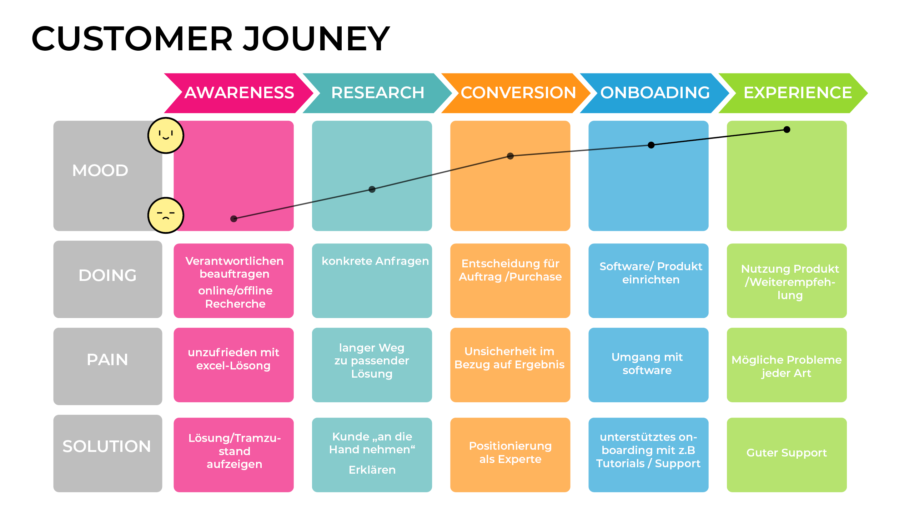

# Prototyp enhancement

Ich habe mich dazu entschieden den Prototypen aus Aufgabe 3 weiter zu entwickeln. Der Prototyp ist [hier](http://ifdtask3.fabianflaig.de/) abrufbar.

Für die Customer Journey Map habe ich die Stimmung, die Doings und sein Problem sowie die meinerseits angebotene Lösung für die Phasen Awareness, Research, Conversion, Onboarding ind Experience angeschaut.

