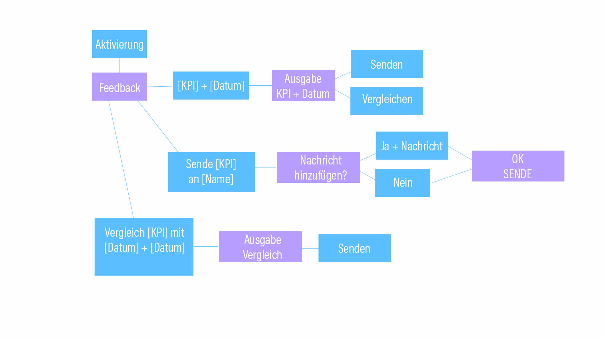
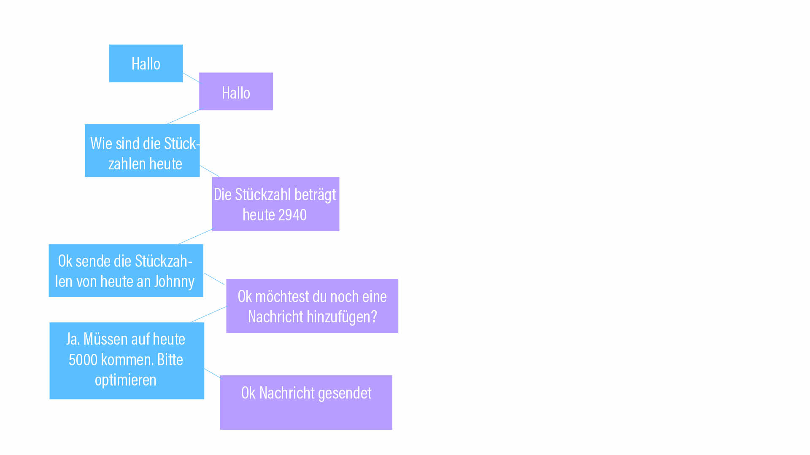

# Aufgabe 4
## VUI

Im ersten Schritt habe ich ein etwas abstrakteres FlowChart erstellt um das VUI abzubilden. Dabei sind die blauen Felder der User und die rosa Felder das VUI. 

Im nächsten Schritt habe ich den einen Beispielprozess konkret dargestellt

[Zum Prototyp](https://htmlpreview.github.io/?https://github.com/FabianFlaig/IFD-SoSe20/blob/master/task%2304/VUI/playground-artyom.html)
