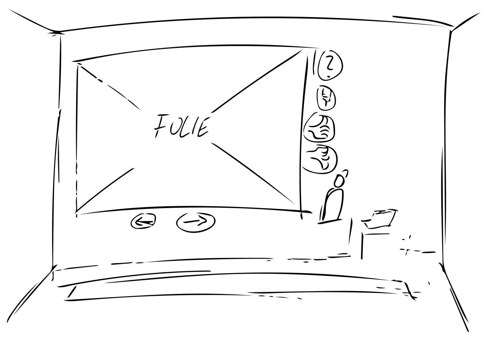

# IFD Aufgabe 7

Als Ausgangspunkt habe ich die virtuelle Vorlesung zu Microinteractions gewählt. 
Bereits beim ersten Anschauen des Videos ist mir aufgefallen, dass die Folien nur schwer zu lesen sind, was nun auch der erste erweiterte Inhalt für meinen Prototypen sein soll. 
Die Folien sollen als eine Art virtueller Bildschirm in das Video angebettet werden und durch weitere Interaktionselemente erweitert werden.
Anhand der Online-Vorlesungs Erfahrungen die in wir alle in den letzten Monaen gemachgt haben ist es mir recht leicht gefallen die wichtigsten Interaktionselemente zusammenzufassen:

- Folien auswählen (weiter/zurück)
- Meldung oder Frage
- Eigenes Mikro an/aus
- Einfache Rückmeldungen oder abstimmungen über Daumen hoch/runter

## Erste Skizze

## Umsetzung in PS

## Umsetzung in PS

        <iframe width="560" height="315" src="https://youtu.be/Y_TZY4bFVrw" frameborder="0" allow="accelerometer; autoplay; encrypted-media; gyroscope; picture-in-picture" allowfullscreen></iframe>

