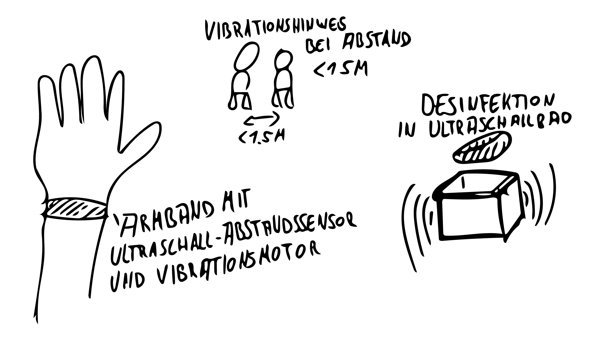
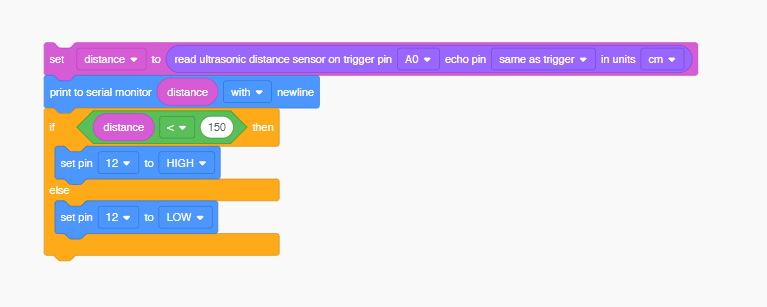

# task 10 
Bei meinem Konzept bekommt jeder, der die Hochschule betritt ein Armband, das zuvor desinfiziert wurde. Das Armband misst den Abstand zu anderen Armbändern und ist der Abstand über mehrere Sekunden unter 1,5m Vibriert das Armband um den User an die Abstandsregel zu erinnern

[tinkercard screencast](https://youtu.be/_D7ru1RB8ds "tinkercard screencast")

Der Einfachheit halber habe ich mich beim Coding an den Codeblocks von Tinkercard bedient

