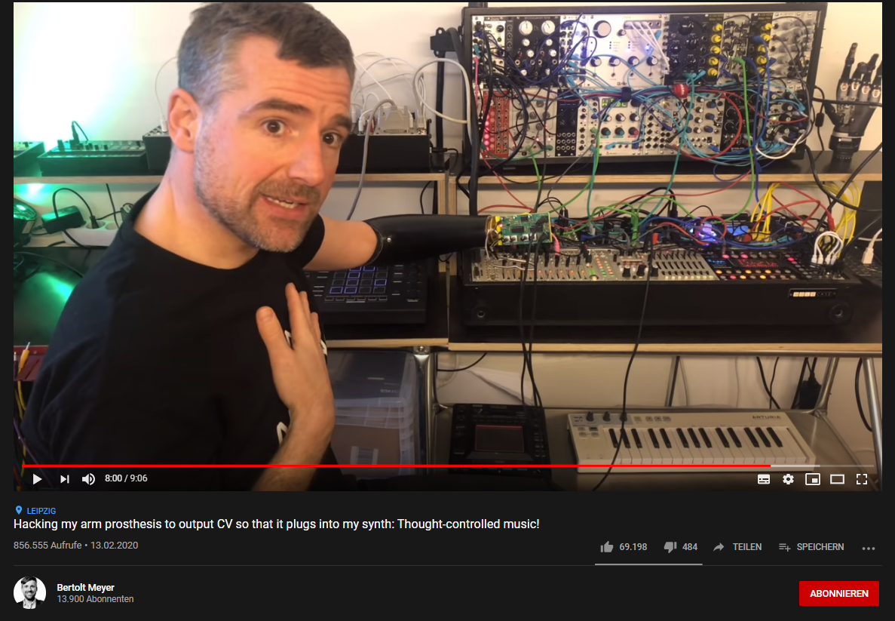
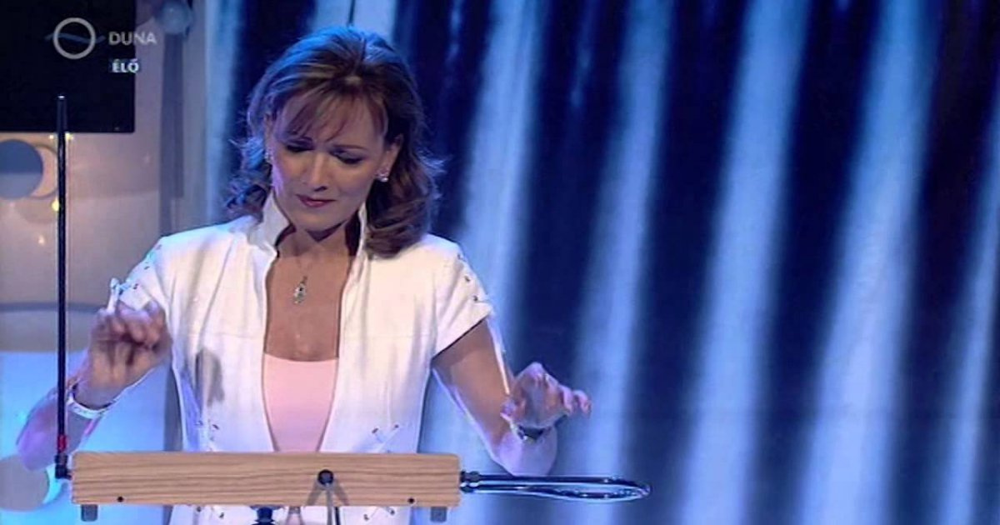

 # Futuristic Interfaces
 
 ## Tought controlled synthesizer
 
 
 
Auf YouTube habe ich ein Video von Bertolt Meyer gefunden, in dem er Musik mit seinen Gedanken steuert. [Zum Video](https://www.youtube.com/watch?v=qSKBtEBRWi4&t=222s)

Er wandelt die Elektrosignale, die seine Prothese aufnimmt in Steuerspannungen (CV) zur Steuerung eines modularen Synthesizers um.

Inline-style: 

## Theremin

[Youtube Video](https://www.youtube.com/watch?v=lY7sXKGZl2w)

Das Thermein ist das einzige Instrument das gespielt werden kann ohne es anzufassen (mal abgesehen von der Stimme). Es wurde zwar schon 1920
aber die Art das Instument zu bedienen finde ich trotzdem interesant und auch futuristisch. Mit einer Hand kann die Tonhöhe mit der anderen die Lautstärke gesteuert werden.

"Theremine arbeiten nach dem Prinzip eines kapazitiven Abstandssensors. Die Hand des Spielers, der durch seine eigene Masse als Erdung fungiert, verändert über die jeweilige Elektrode („Antenne“) den LC-Schwingkreis eines Oszillators: 
Er beeinflusst sowohl die Frequenz als auch die Güte des Schwingkreises, indem er den kapazitiven Anteil des Schwingkreises und dessen Dämpfung beeinflusst." (Wikipedia)

